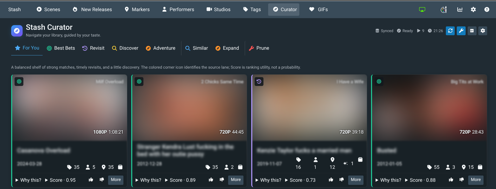

<p align="center">
  
</p>
<h1 align="center">Stash Curator</h1>
<p align="center"><strong>Navigate your library, guided by your taste.</strong></p>

Stash Curator is a local-first recommendation and discovery plugin for
[Stash](https://github.com/stashapp/stash). It learns from viewing history and direct
feedback, explains why an item appears, and keeps the model in a sidecar SQLite
database you control.



## Install

Preview requirements: **Stash v0.31** and **Python 3.12+** available to Stash's
plugin runtime. Add this source under **Settings → Plugins → Available Plugins**:

```text
https://mrx-31415.github.io/stash-curator/index.yml
```

Install **Stash Curator**, reload plugins, open the compass in Stash's navigation,
then select **Sync library** once. See [Getting started](docs/getting-started.md) for
configuration, updates, and backups.

## What it does

| Choose | Explore | Maintain |
| --- | --- | --- |
| For You, Best Bets, and Revisit lanes | Discover and Adventure challenge the model | Prune review applies a reversible tag |
| Preference-aware Similar results | Optional read-only StashDB Expand | Curator never deletes media |
| “Why this?” evidence and score details | Variety across performers, studios, and content | Local feedback and event history |

Curator separates long-term **Appeal** from **Current Fit**, then builds varied lanes
instead of sorting everything by one opaque score. Read [how recommendations work](docs/recommendations.md)
or browse the complete [documentation site](https://mrx-31415.github.io/stash-curator/).

## Safety and privacy

Preference history, learned weights, and explanations stay local. StashDB discovery
is opt-in and sends bounded read-only metadata queries, never your preference model.
The only intentional Stash mutation is an explicit Prune action that adds or removes
the configured tag. Back up the sidecar before uninstalling; see [Privacy](docs/privacy.md).

## Status

Stash Curator is **Preview / pre-1.0**. Core recommendation, Similar, Expand, Prune,
backup, and packaging flows are implemented; installed-system compatibility and
performance testing continue. The runtime is dependency-free. Development uses
[uv](https://docs.astral.sh/uv/); see [Contributing](docs/contributing.md).

## Project provenance

The idea was inspired by [Restash by Espionage9248](https://github.com/Espionage9248/Restash/tree/main/restash).
Stash Curator is an independent project with no implied affiliation or endorsement.

Stash Curator is primarily generated with AI coding agents under human direction,
review, and testing.

Licensed under [AGPL-3.0](LICENSE).
