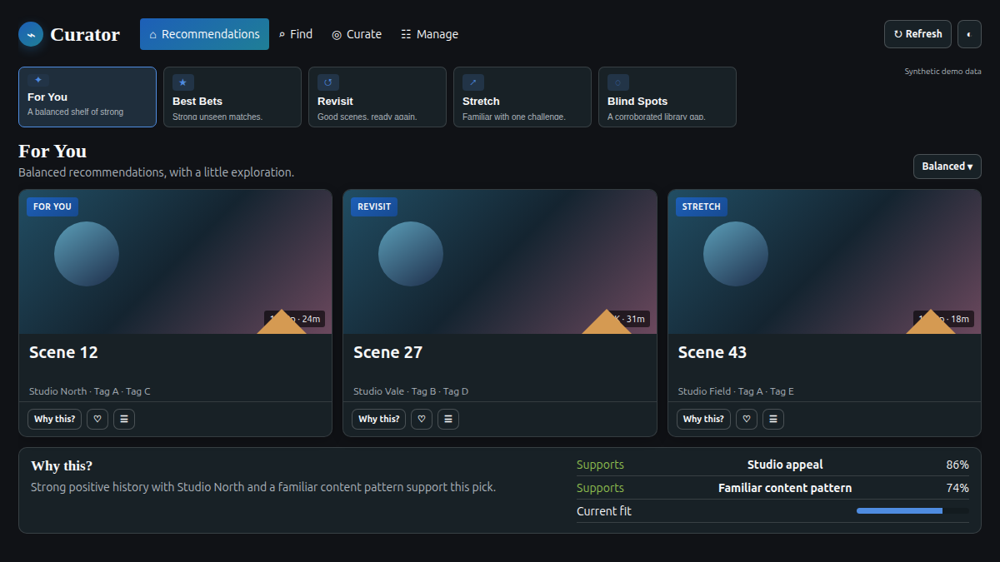

<p align="center">
  
</p>
<h1 align="center">Stash Curator</h1>
<p align="center"><strong>Navigate your library, guided by your taste.</strong></p>

Stash Curator is a local-first recommendation and curation plugin for
[Stash](https://github.com/stashapp/stash). It uses library metadata, viewing history,
and direct feedback to recommend scenes from your library, explains why an item
appears, and keeps the preference model in a separate SQLite database you control.



## Install

Preview requirements: **Stash v0.31** and **Python 3.12+** available to Stash's
plugin runtime. Local recommendations do not require StashDB. The required platform
binary ships with the plugin; no runtime package installation is needed.
Add this source under
**Settings → Plugins → Available Plugins**:

```text
https://mrx-31415.github.io/stash-curator/index.yml
```

Install **Stash Curator**, reload plugins, open the compass in Stash's navigation,
then run **Sync library** once to build the first model. See [Getting started](docs/getting-started.md)
for first-build expectations, configuration, updates, and backups.

## What it does

- **Recommendations:** For You balances dependable matches, revisits, and discovery;
  Best Bets, Revisit, Stretch, Blind Spots, and Dormant let you choose the slate.
  “Why this?” makes the evidence inspectable.
- **Find:** Similar connects related local scenes and performers; Expand and Performer
  Hunt optionally explore StashDB metadata against your local model.
- **Curate:** Pair picks teach shared preferences, Tag sentiment corrects a belief
  directly, and Impact shows what a later model build changed. Manage keeps review,
  backups, tasks, and settings together; Prune is always reversible and never deletes media.

Curator separates long-term **Appeal** from **Current Fit**, then builds varied lanes
instead of sorting everything by one opaque score. Read [how recommendations work](docs/recommendations.md)
or browse the complete [documentation site](https://mrx-31415.github.io/stash-curator/).

## Safety and privacy

Preference history, learned weights, and explanations stay local. StashDB discovery
is opt-in and sends bounded read-only metadata queries, never your preference model.
The only intentional Stash mutation is an explicit Prune action that adds or removes
the configured tag. Whisparr receives only an item you explicitly send. See [Privacy](docs/privacy.md).

## Status

Stash Curator is **Preview / pre-1.0**. The first sync/model build can take several
minutes on a large library. A persistent background worker can apply model and recent-play
updates without an open tab; scheduled Expand refresh, sync/build, and backups are optional.
Development uses [uv](https://docs.astral.sh/uv/); see [Contributing](docs/contributing.md).

## Project provenance

The idea was inspired by [Restash by Espionage9248](https://github.com/Espionage9248/Restash/tree/main/restash).

Stash Curator is primarily generated with AI coding agents under human direction,
review, and testing.

Licensed under [AGPL-3.0](LICENSE).
