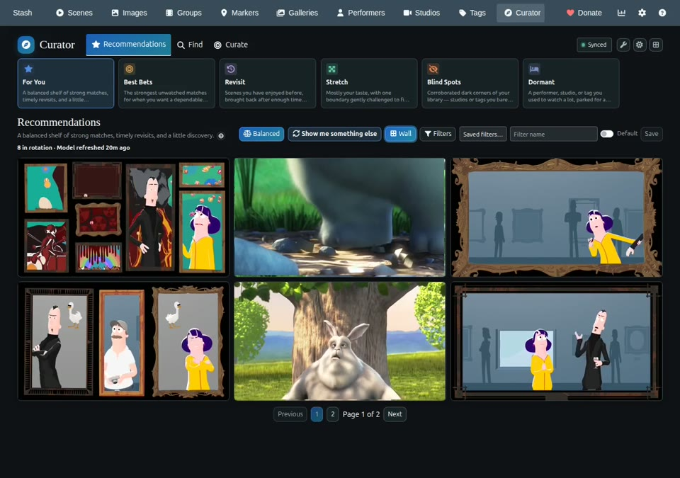
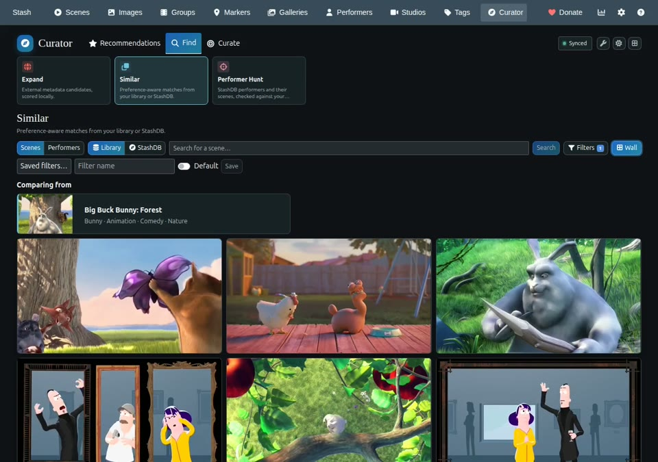
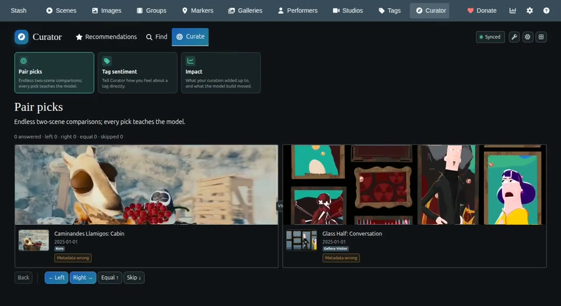

  

<h1 align="center">Stash Curator</h1>

<strong>Find scenes in your library, discover more on StashDB, and improve the results with feedback.</strong>

Stash Curator learns your taste from library metadata, viewing history, and feedback.
It recommends scenes you already have and helps you discover candidates on
[StashDB](https://stashdb.org). You can see why a scene was suggested and correct
the model when it gets something wrong.

[Install](#install) · [Watch the eleven-second tour](https://mrx-31415.github.io/stash-curator/#tour)

  

The tour shows moving previews in Recommendations, Find, and Curate. It uses fictional metadata and <a href="https://mrx-31415.github.io/stash-curator/#tour">credited Blender film clips</a>; no personal library appears.

## Install

Requires **Stash v0.31** with **Python 3.12+** available to its plugin runtime.
StashDB is optional for recommendations from your own library.

1. In Stash, open **Settings → Plugins → Available Plugins** and add
   `https://mrx-31415.github.io/stash-curator/index.yml` as a plugin source.
2. Install **Stash Curator** and reload plugins.
3. Open the compass in Stash's navigation and select **Sync library** to build
   your first recommendation model.

The first build can take several minutes on a large library. See
[Getting started](docs/getting-started.md) for setup, updates, and backups.

## Explore Curator

### Recommendations

Browse six lanes of scenes from your library: For You, Best Bets, Revisit, Stretch,
Blind Spots, and Dormant. Each offers a different way to find something to watch.

### Find

Find opens on Expand, which ranks StashDB candidates against your taste. Similar
finds related scenes or performers in your library or on StashDB; Performer Hunt
follows one performer's catalog. An external result does not mean you have the scene.

  

### Curate

Choose between two scenes in Pair picks, give direct feedback, or rate a tag to
help Curator learn. Open **Why this?** on a result to inspect its reasons. After a
model build, Impact shows what your feedback changed.

  

Each recommendation distinguishes **Appeal** (your longer-term interest) from
**Current Fit** (whether it suits you now). Read [how recommendations work](docs/recommendations.md)
for the scoring details.

## Safety and privacy

- Your history, feedback, and model stay in a local SQLite database you control.
- StashDB discovery is optional and read-only. StashDB never receives your model.
- Curator never deletes media. An explicit Prune action only adds or removes a tag.
- Whisparr receives an item only when you choose **Send to Whisparr**.

See [Privacy](docs/privacy.md) for details.

## Status

Stash Curator is **preview software (pre-1.0)**. Automatic background updates and
scheduled tasks are optional; see [Using Curator](docs/using-curator.md).
Developers can start with [Contributing](docs/contributing.md).

## Project provenance

The idea was inspired by [Restash by Espionage9248](https://github.com/Espionage9248/Restash/tree/main/restash).

Stash Curator is primarily generated with AI coding agents under human direction,
review, and testing.

Licensed under [AGPL-3.0](LICENSE).
