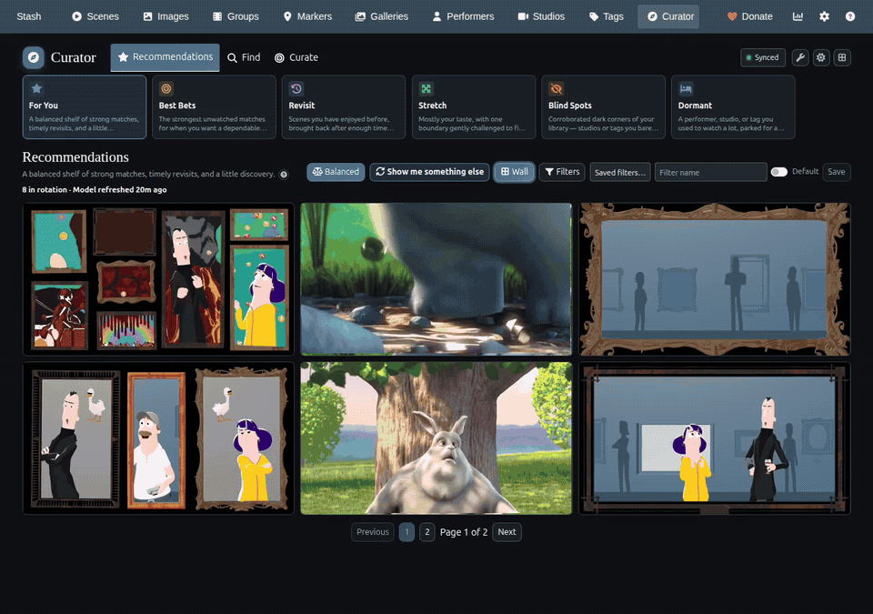
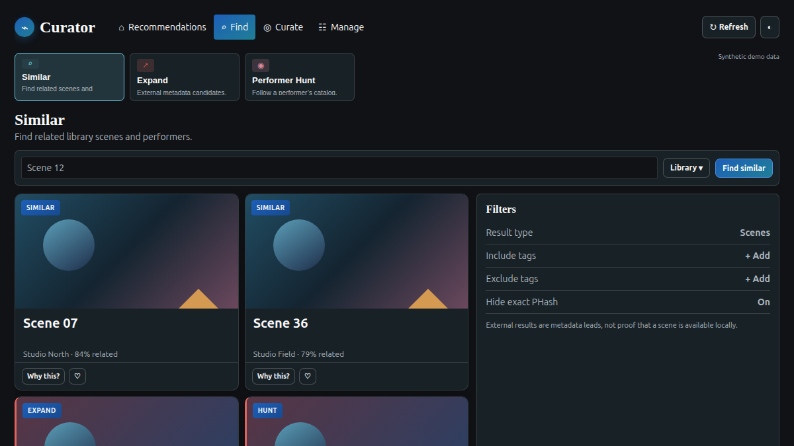
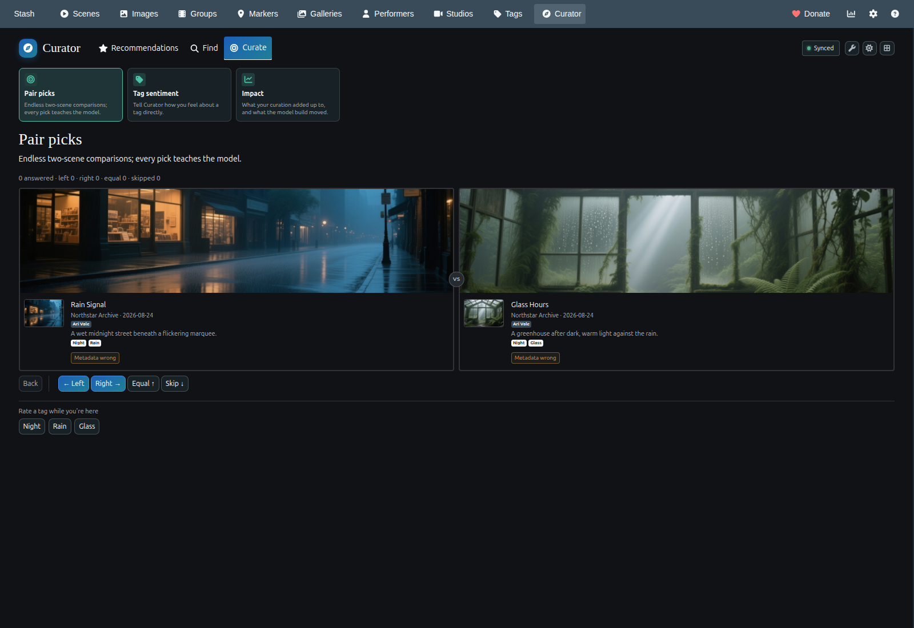

<p align="center">
  
</p>
<h1 align="center">Stash Curator</h1>
<p align="center"><strong>Local recommendations and StashDB discovery — curated to your taste.</strong></p>

Stash Curator learns your taste from your library metadata, viewing history, and
feedback — then uses that taste to recommend from two places: the scenes already in
your library, and the wider catalog on [StashDB](https://stashdb.org). Inside your
library, lanes like For You and Best Bets mix favorites, revisits, and discovery.
Beyond it, Expand and Performer Hunt rank StashDB candidates by the same taste;
external results are leads.

<p align="center">
  
</p>

<p align="center">
  
</p>

<p align="center">
  
</p>

<p align="center">
  
</p>

## Install

Preview requirements: **Stash v0.31** and **Python 3.12+** available to Stash's
plugin runtime. Local recommendations do not require StashDB. The required platform
binary ships with the plugin; no runtime package installation is needed.
Add this source under
**Settings → Plugins → Available Plugins**:

```text
https://mrx-31415.github.io/stash-curator/index.yml
```

Install **Stash Curator**, reload plugins, open the compass in Stash's navigation,
then run **Sync library** once to build the first model. See [Getting started](docs/getting-started.md)
for first-build expectations, configuration, updates, and backups.

## What it does

- **Recommendations from your library, curated to your taste.** For You, Best Bets,
  Revisit, Stretch, Blind Spots, and Dormant mix favorites, revisits, and discovery.
  Variety is presentation, not taste.
- **The same taste, beyond your library.** Similar finds related local scenes and
  performers; Expand and Performer Hunt rank StashDB candidates against the same
  model. External results are leads.
- **Inspect and correct.** “Why this?” shows the evidence and score tree (Appeal vs
  Current Fit vs confidence); pair picks, tag sentiment, and thumbs correct a belief
  directly.

Curator separates long-term **Appeal** from **Current Fit**, then builds varied lanes
instead of sorting everything by one opaque score. Read [how recommendations work](docs/recommendations.md)
or browse the complete [documentation site](https://mrx-31415.github.io/stash-curator/).

## Safety and privacy

Runs locally. Your history, feedback, and model stay in a SQLite sidecar you control;
StashDB is optional, read-only, and never sees your model. The only Stash mutation is
an explicit Prune action that adds or removes the configured tag; Curator never deletes
media. Whisparr receives only an item you explicitly send. See [Privacy](docs/privacy.md).

## Status

Stash Curator is **Preview / pre-1.0**. The first sync/model build can take several
minutes on a large library. A persistent background worker can apply model and recent-play
updates without an open tab; scheduled Expand refresh, sync/build, and backups are optional.
Development uses [uv](https://docs.astral.sh/uv/); see [Contributing](docs/contributing.md).

## Project provenance

The idea was inspired by [Restash by Espionage9248](https://github.com/Espionage9248/Restash/tree/main/restash).

Stash Curator is primarily generated with AI coding agents under human direction,
review, and testing.

Licensed under [AGPL-3.0](LICENSE).
